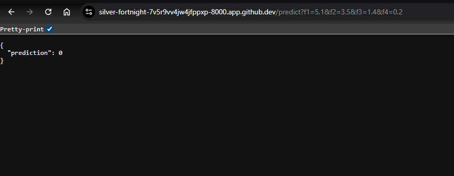

# Production-Style MLOps Batch Prediction System

<div align="center">

# ML Batch Prediction Pipeline

Production-inspired end-to-end MLOps mini system for automated batch inference, monitoring, API serving and CI/CD.


</div>

---

## Live Project Components

* Automated Batch Prediction Pipeline
* Database-backed ML Inference
* Monitoring Dashboard
* FastAPI Prediction API
* Dockerized Deployment
* GitHub Actions CI/CD

---

# Table of Contents

* [Overview](#overview)
* [Features](#features)
* [Architecture](#architecture)
* [Tech Stack](#tech-stack)
* [Project Structure](#project-structure)
* [Quick Start](#quick-start)
* [Screenshots](#screenshots)
* [API Usage](#api-usage)
* [Task Requirements Coverage](#task-requirements-coverage)
* [Advanced Extensions](#advanced-extensions)
* [Future Improvements](#future-improvements)

---

# Overview

This project simulates a production-style machine learning batch inference system.

The system:

* Reads data from a database
* Loads a trained ML model
* Runs batch predictions
* Stores predictions back in the database
* Executes scheduled prediction jobs
* Exposes prediction serving through API
* Provides monitoring dashboard
* Supports containerized deployment
* Includes CI/CD automation

Originally developed for an academic batch prediction task, later extended into a mini MLOps portfolio project.

---

# Features

## Core Pipeline

* Scheduled batch inference
* Prediction persistence
* Automated database workflow
* Modular ML pipeline structure

## MLOps Features

* Streamlit dashboard monitoring
* REST prediction API
* Docker deployment
* GitHub Actions automation
* CI/CD workflow integration

---

# Architecture

```text
Input Data (Database)
   ↓
Batch Prediction Pipeline
   ↓
Trained ML Model
   ↓
Predictions Storage
   ↓
Monitoring Dashboard
   ↓
FastAPI Model Serving
   ↓
Docker + GitHub Actions Automation
```

---

# Tech Stack

| Layer            | Technology     |
| ---------------- | -------------- |
| ML               | Scikit-learn   |
| Database         | SQLite         |
| API              | FastAPI        |
| Dashboard        | Streamlit      |
| Automation       | Schedule       |
| Containerization | Docker         |
| CI/CD            | GitHub Actions |

---

# Project Structure

```bash
ML-Batch-Pipeline/
│
├── app/
│   ├── train.py
│   ├── database.py
│   ├── batch_predict.py
│   ├── scheduler.py
│   ├── dashboard.py
│   └── api.py
│
├── models/
│   └── model.pkl
│
├── sql/
│   └── schema.sql
│
├── screenshots/
│   ├── api-endpoint.png
│   ├── GitHub Actions.png
│   ├── Streamlit Dashboard.png
│   └── Streamlit Dashboard 2.png
│
├── .github/workflows/
│   └── pipeline.yml
│
├── Dockerfile
├── docker-compose.yml
└── requirements.txt
```

---

# Quick Start

## Clone Repository

```bash
git clone https://github.com/ns-niam/ML-Batch-Pipeline.git
cd ML-Batch-Pipeline
```

## Install

```bash
pip install -r requirements.txt
```

## Train Model

```bash
python app/train.py
```

## Create Database

```bash
python app/database.py
```

## Run Batch Prediction

```bash
python app/batch_predict.py
```

## Run Scheduler

```bash
python app/scheduler.py
```

## Launch Dashboard

```bash
streamlit run app/dashboard.py
```

## Run API

```bash
uvicorn app.api:app --host 0.0.0.0 --port 8000
```

## Docker Deployment

```bash
docker compose up --build
```

---

# API Usage

Example:

```http
/predict?f1=5.1&f2=3.5&f3=1.4&f4=0.2
```

Response:

```json
{
  "prediction": 0
}
```

---

# Screenshots

## Monitoring Dashboard


---

## Prediction Analytics Dashboard


---

## FastAPI Endpoint



---

## GitHub Actions CI/CD


---

# Task Requirements Coverage

|  Requirement                     | Status |
| ---------------------------------------- | ------ |
| Read input data from database            | ✅      |
| Run trained ML model                     | ✅      |
| Store predictions in database            | ✅      |
| Automatic scheduled execution            | ✅      |
| Python scheduler / cron style automation | ✅      |

---

# Advanced Extensions Added 

* Streamlit Monitoring Dashboard
* FastAPI Model Serving API
* Dockerized ML Deployment
* GitHub Actions Automation
* CI/CD Pipeline
* Production-style Modular MLOps Architecture

---

# CI/CD Workflow

GitHub Actions workflow can be found here:

```bash
.github/workflows/pipeline.yml
```

Includes:

* Dependency install
* Model training
* Database setup
* Batch prediction execution

---

# Resume Highlights

* Built production-style MLOps batch prediction system using Python, FastAPI, Docker and GitHub Actions.

* Developed automated scheduled inference pipeline with database-backed prediction storage and monitoring dashboard.

* Implemented REST API model serving and containerized ML deployment.

---

# Future Improvements

* PostgreSQL migration
* MLflow experiment tracking
* Airflow orchestration
* Drift monitoring
* Kubernetes deployment

---

# Repository Navigation

Quick access:

* App Code → `app/`
* SQL Schema → `sql/`
* Docker Config → `Dockerfile`
* CI/CD Workflow → `.github/workflows/pipeline.yml`
* Screenshots → `screenshots/`

---

# Author

Niam

 AI/ML Engineering Student

---

## Project Status

✅ Completed and Functional

